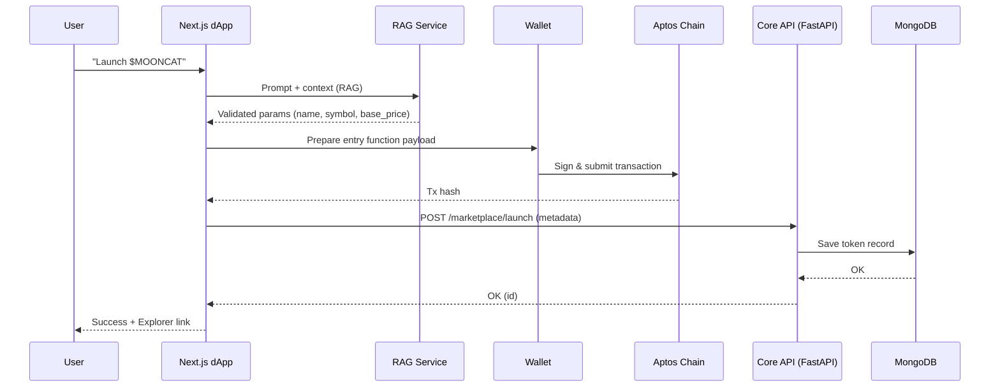
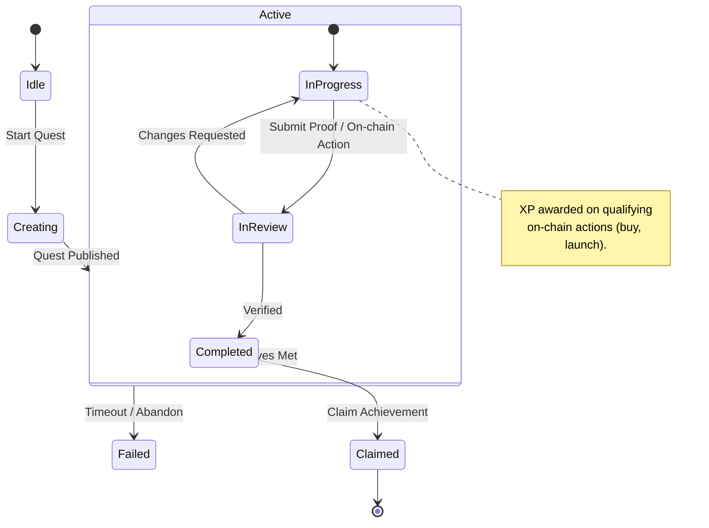
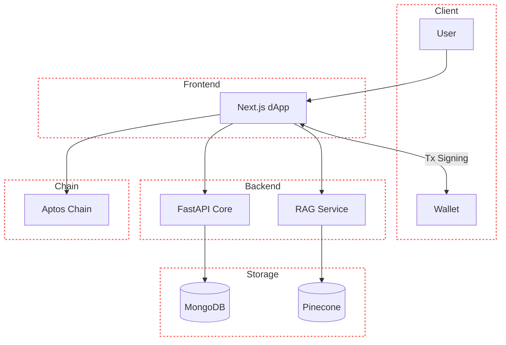
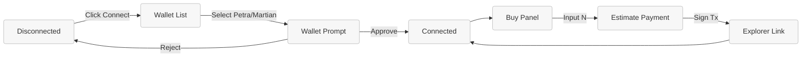

# Prompt.Fun — Launch & Trade Meme Tokens With Just a Prompt (Built on Aptos)

## 1) Summary (Elevator Pitch)
Prompt.Fun is a chat-first, on-chain meme coin launcher. In a single prompt, anyone can create and trade tokens backed by a transparent bonding curve on Aptos. It combines a playful, terminal‑inspired UI, a wallet‑native dApp, and an AI copilot that translates natural language into on‑chain actions. The result: crypto that’s accessible, viral, and fun.

## 2) The Problem
- Launching tokens is still intimidating: fragmented tools, confusing flows, and high cognitive overhead.
- Discovery is poor: new creators struggle to reach audiences; users can’t easily find fresh tokens early.
- Education gap: on‑chain mechanics (curves, supply, fees) aren’t approachable to mainstream users.

## 3) Our Solution
Prompt.Fun collapses the end‑to‑end flow into one conversational surface:
- “Make a coin for my cat. Name: MeowFi, symbol: MEO” → AI copilot generates parameters and on‑chain actions.
- Bonding curve auto‑launch provides transparent pricing & liquidity from block one.
- A simple marketplace shows newly launched tokens instantly (no indexer delays) while still linking to on‑chain truth.

## 4) What It Does (Key Features)
- Prompt‑based token launch (natural language → on‑chain entry functions)
- Wallet‑native dApp with one‑click buy (and planned sell)
- Transparent bonding curve with live price and supply readouts
- XP/quests and achievement system to encourage engagement
- AI copilot with RAG context for safety and guidance
- Clean marketplace fed by backend to avoid indexer lag

## 5) How It Works (User Flow)
1) Connect Aptos wallet in the dApp.
2) Pick a token idea (via chat or form), set name/symbol.
3) Launch on a bonding curve (on‑chain publish + initialize stores).
4) Buy N tokens with one click; see transaction hash and explorer link.
5) Track supply, price, and XP; browse newly launched tokens in the marketplace.

## 6) Demo Links (local dev)
- Frontend (Next.js): http://localhost:3000
- dApp (Next.js + Aptos wallet): http://localhost:3001
- Backend (FastAPI): http://localhost:8001 (docs: /docs)
- RAG service (FastAPI): http://localhost:8002
- Aptos Explorer (account): https://explorer.aptoslabs.com/account/0x16d281ff60374558dc2412dc6c759061a744a58bb0c69030307c5b4f889a3535?network=testnet

## 7) Smart Contracts (Move on Aptos Testnet)
- Deployed account: 0x16d281ff60374558dc2412dc6c759061a744a58bb0c69030307c5b4f889a3535
- Modules:
  - BondingCurve: `…::BondingCurve`
  - PromptToken: `…::PromptToken`
  - XPSystem: `…::XPSystem`
- Exposed highlights:
  - Entry: `launch_token`, `buy_token` (sell in roadmap)
  - View: `get_token_price`, `get_token_supply`, `token_exists`

## 8) Architecture Overview
- Frontend (prompt-fun-dapp)
  - Next.js + Aptos wallet adapter
  - Wallet status bar with price/supply readouts, buy N PROMPT
  - Uses env var `NEXT_PUBLIC_CONTRACT_ADDRESS` for redeploy agility
- Backend (lngchainBackend)
  - FastAPI + MongoDB + Pinecone + Gemini (Google Generative AI)
  - RAG chat, token marketplace CRUD, safe orchestration
- Core API (backend)
  - User profile, achievements, quests, activity
  - Chat/RAG endpoints and token launch/listing endpoints
- Move Contracts
  - BondingCurve, PromptToken, XPSystem; stores initialized on publish

## 9) Why Aptos
- Throughput and low latency enable snappy UX for launches and trades.
- Move’s resource model offers safety and clear invariants for token accounting.
- Mature wallet ecosystem (Petra, Martian) for frictionless onboarding.

## 10) Differentiation
- Conversational, “type to create” UX instead of form‑heavy token wizards.
- Transparent bonding curve with live estimations (no mystery pricing).
- Built‑in XP/quests to reward exploration and growth loops.
- AI copilot reduces onboarding friction and educates while guiding.

## 11) Safety & Guardrails
- RAG‑assisted instructions ensure parameters are valid/safe before calling entry functions.
- Clear price/supply displays from view functions before signing transactions.
- Explorer links and on‑chain proofs surfaced on success.

## 12) How to Run (local)
- Prereqs: Node.js (v18+), Python 3.10+, MongoDB, Pinecone + Google API keys (for RAG)
- Services:
  - Frontend: `cd frontend && npm run dev -- --port 3000`
  - dApp: `cd prompt-fun-dapp && npm run dev -- --port 3001`
  - Backend: `cd backend && ./venv/bin/python -m uvicorn main:app --reload --host 0.0.0.0 --port 8001`
  - RAG: `cd lngchainBackend && ./venv/bin/python -m uvicorn server:app --reload --host 0.0.0.0 --port 8002`
- Env: Set `NEXT_PUBLIC_CONTRACT_ADDRESS=0x16d281ff60374558dc2412dc6c759061a744a58bb0c69030307c5b4f889a3535`

## 13) Roadmap (Post‑hackathon)
- Sell flow on the bonding curve + portfolio view
- Creator pages, social discovery, and trending signals
- Enhanced safety checks and parameter simulations
- Cross‑chain intents and fee abstraction experiments
- Mobile‑first UI and shareable, embeddable token cards

## 14) Impact & Potential
- Lowers the barrier to express ideas as tradable on‑chain assets.
- Turns meme culture into a safe, transparent, and engaging on‑chain playground.
- A new acquisition channel for Aptos: chat‑native, creator‑led, community‑driven.

## 15) The Ask
- Prize consideration, mentorship, and ecosystem support to ship the public beta.
- Intros to Aptos ecosystem partners (wallets, infra, creator communities) for launch.

---
Built with Move, Next.js, FastAPI, Pinecone, and Gemini on Aptos Testnet. Let’s make crypto fun—and effortless—for everyone.


## 16) Visuals & Diagrams

### A) System Architecture (High-level)
```mermaid
flowchart LR
  subgraph Client
    U[User]
    W[Wallet (Petra/Martian)]
  end

  subgraph Frontend
    F[Next.js dApp\n(prompt-fun-dapp)]
  end

  subgraph Backend
    B1[FastAPI: Core API]
    B2[FastAPI: RAG Service\n(lngchainBackend)]
    DB[(MongoDB)]
  end

  subgraph AI & Vectors
    PC[(Pinecone)]
    GM[Gemini (Google\nGenerative AI)]
  end

  subgraph On-Chain
    APT[Aptos Testnet]
    MV[Move Modules:\nBondingCurve, PromptToken, XPSystem]
  end

  U -->|Chat / UI| F
  F <-->|Tx Signing| W
  F <-->|REST| B1
  F <-->|RAG Chat| B2
  B1 --> DB
  B2 <-->|Embeddings / Retrieval| PC
  B2 --> GM
  F -->|Submit Tx| APT
  APT --> MV
  B1 -. indexer-lag-free .-> F
```

<picture>
  <source type="image/svg+xml" srcset="docs/diagrams/architecture.svg" />
  
</picture>

<em>Figure A: System Architecture overview</em>


### B) End-to-End: Launch Token (Sequence)


<picture>
  <source type="image/svg+xml" srcset="docs/diagrams/launch-sequence.svg" />
  
</picture>

<em>Figure B: End-to-end launch sequence</em>


### C) Buy N Tokens (Bonding Curve Flow)
```mermaid
flowchart TD
  A[User sets amount N] --> B[UI queries view fns\nget_token_supply, get_token_price]
  B --> C[Compute estimated payment\nprice = base_price * (supply + N)]
  C --> D[User signs buy_token(symbol, N, payment)]
  D --> E[Aptos executes\nupdates supply]
  E --> F[UI refreshes price/supply\nconfirms hash + link]
```

<picture>
  <source type="image/svg+xml" srcset="docs/diagrams/buy-flow.svg" />
  
</picture>

<em>Figure C: Buy N tokens on a bonding curve</em>


### D) Data Responsibilities
```mermaid
flowchart LR
  subgraph Frontend
    F[UX, Wallet, Chat]
  end
  subgraph Backend
    API[Core API]\n[Profiles, Achievements, Marketplace]
    RAG[RAG Service]\n[Embeddings, Retrieval, LLM]
  end
  subgraph Storage
    M[(MongoDB)]
    P[(Pinecone Vectors)]
  end
  subgraph Chain
    C[Aptos]\n[Move Modules & State]
  end

  F --> API
  API --> M
  F --> RAG
  RAG --> P
  F --> C
```

<picture>
  <source type="image/svg+xml" srcset="docs/diagrams/data-responsibilities.svg" />
  
</picture>

<em>Figure D: Data responsibilities and boundaries</em>


### E) XP / Quests State Machine


<picture>
  <source type="image/svg+xml" srcset="docs/diagrams/xp-quests-state-machine.svg" />
  
</picture>

<em>Figure E: XP / quests state machine</em>

### F) Marketplace Listing Flow
```mermaid
flowchart LR
  U[User] --> UI[Next.js dApp]
  UI -->|GET /api/marketplace/launched| BE[Backend (FastAPI)]
  BE --> DB[(MongoDB)]
  DB --> BE
  BE --> UI
  UI --> L[List Tokens]

  subgraph Launch Path (Write)
    UI2[Launch Form/Chat] -->|POST /api/marketplace/launch| BE2[Backend]
    BE2 --> DB
  end

  UI -. Explorer Link .-> EX[Explorer]
  EX:::ext

  classDef ext fill:#eef,stroke:#99f
```

<picture>
  <source type="image/svg+xml" srcset="docs/diagrams/marketplace-listing-flow.svg" />
  
</picture>

<em>Figure F: Marketplace listing flow</em>

### G) Threat Model (Trust Boundaries)


<picture>
  <source type="image/svg+xml" srcset="docs/diagrams/threat-model.svg" />
  
</picture>

<em>Figure G: Threat model and trust boundaries</em>


### H) Bonding Curve Math (Simplified)
```mermaid
flowchart TD
  S[Current supply s] --> P[Base price p]
  N[Buy amount N] --> C[Estimated payment]
  P --> C
  S --> C

  C[[payment ≈ p * (s + N)]]

  subgraph Example
    s1[Example: s=100]
    p1[p=1 APT]
    n1[N=5]
    s1 --> e1[estimate]
    p1 --> e1
    n1 --> e1
    e1[[payment ≈ 1 * (100 + 5) = 105 APT]]
  end
```

<picture>
  <source type="image/svg+xml" srcset="docs/diagrams/bonding-curve-math.svg" />
  
</picture>

<em>Figure H: Simplified bonding curve payment estimation</em>

### I) Wallet Connect UX (Wireframe)


<picture>
  <source type="image/svg+xml" srcset="docs/diagrams/wallet-connect-wireframe.svg" />
  
</picture>

<em>Figure I: Wallet connect & buy flow (wireframe)</em>
